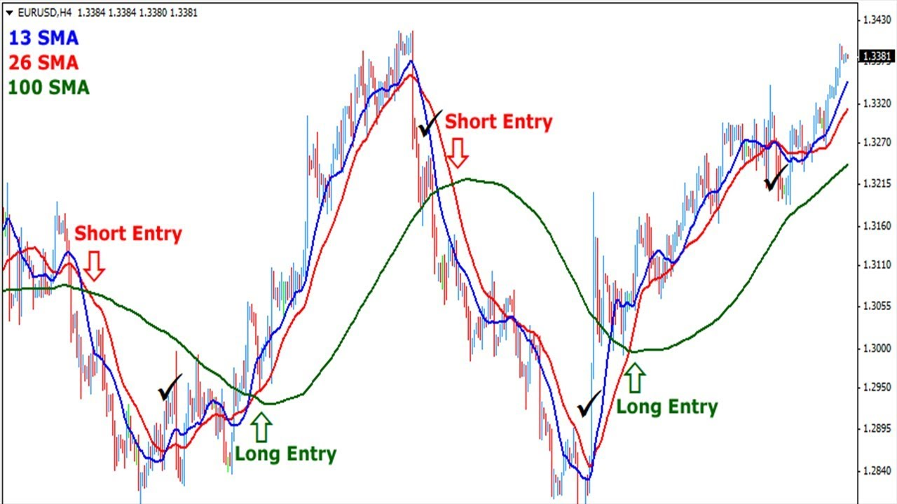
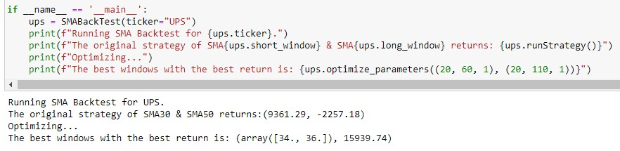
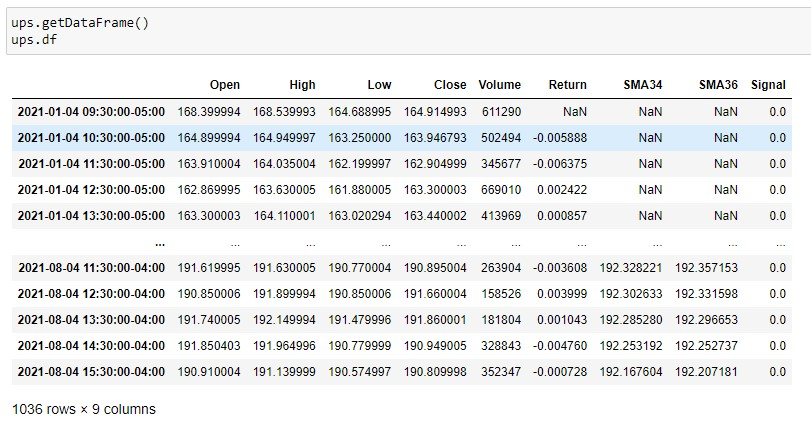
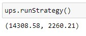
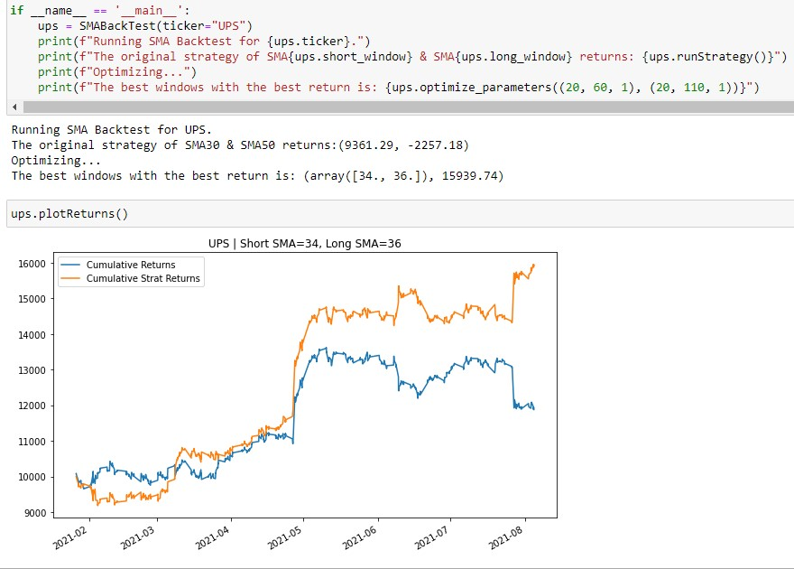
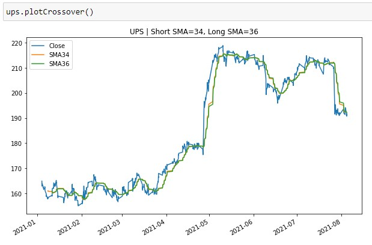
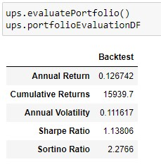

# SMA Back Tester Class

## Purpose
The purpose of this python class is to backtest an SMA trading strategy. The idea is to go long when the shorter window's value is higher than the longer window's value and to short the stock when the shorter window's value is less than the longer window's value.

The SMABackTest class is capable of returning graphs and dataframes on the performance of the trading strategy. There is also an optimizer function, which will test a range of short and long windows for the optimal trading strategy of the given time range. 

## Methods
* getDataFrame()

* runStrategy()

  
* plotReturns()

* plotCrossover()

* evaluatePortfolio()

* set_parameters(short_window, long_window)
* optimize_parameters(short_range, long_range) 

## Dependencies
* Pandas v1.1.3
* NumPy v1.19.2
* MatPlotLib.PyPlot v3.3.2
* yFinance v0.1.63
* SciPy v1.5.2)